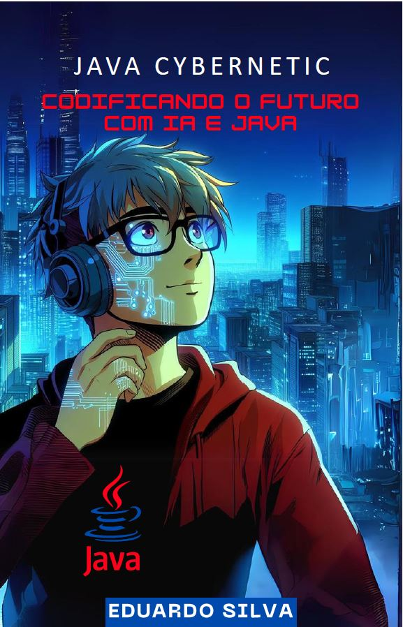

-------

# Projeto EBOOK Gerado por I.A.s

Projeto com o objetivo de gerar um ebook digital com as facilidades das ferramentas de IA. todos os prompts
seguem abaixo.

<a href="output/E-book Java Cybernetic.pdf" title="View PDF now"> 📕Clique aqui para ler</a>

## 💻 Tecnologias utilizadas no projeto

- [ChatGPT](https://chat.openai.com/) 
- [Copilot](https://www.microsoft.com/pt-br/microsoft-copilot)
- [PowerPoint](https://www.microsoft.com/en/microsoft-365/powerpoint)

## 🧠 Prompts

ChatGPT：

|   Ação   | prompt                                                                                                                                                                                                                                                                         |
| :------: | ------------------------------------------------------------------------------------------------------------------------------------------------------------------------------------------------------------------------------------------------------------------------------ |
|  título  | Crie um titulo de ebook sobre o tema IA, o ebook é do nicho programação o subnicho é Linguagem Java, o titulo deve ser chamativo e curto e tenha uma tematica Cyberpunk no titulo, me liste 5 variações de titulos                                                  |
| conteúdo | Faça  um ebook, com foco em como um programador Java pode utilizar IAs como por exemplo o chatGPT e o Copilot para ajudar em problemas reais na programação, demostrando as principais formas de utilização de IA e como isso pode ser bom para o futuro do programador , sempre obedecendo as {Regras} a baixo: {Regras}>Explique sempre de maneira simples>Sempre traga exemplos de código em contextos reais>sempre deixe um titulo sugestivo por tópico

Copilot ：

|  Ação  | prompt                                                                                 |
| :----: | -------------------------------------------------------------------------------------- |
| título |2D drawing in Japanese cartoon style of a young man from CyberPunk animation |

## ✨ Features

- Conteúdo gerado via ChatGPT
- Imagens geradas via Copilot

## 📚 Materiais

- Imagens utilizadas em `assets`
- ebook gerado durante as aulas em `output`

